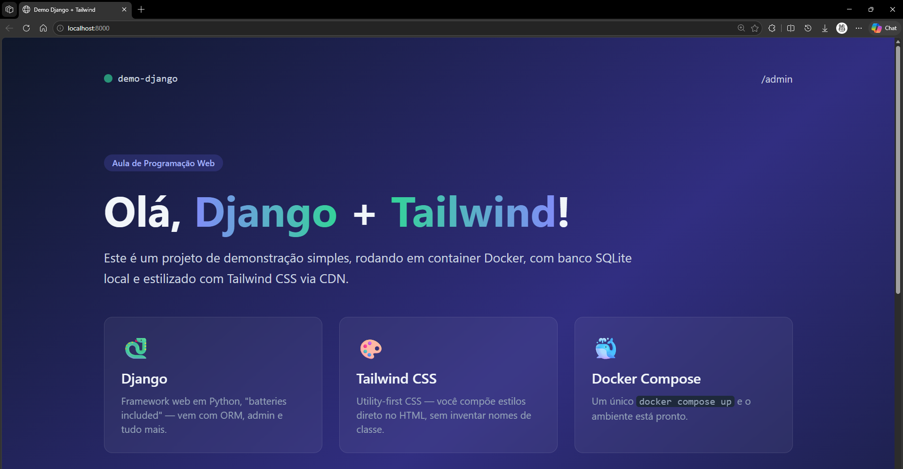

# [Roteiro Django - Parte 1]

**Nome:** [Taylanne Patricia Mendes]
**Curso:** [Ciência da Computação]
**Instituição:** [Universidade Federal de Ouro Preto]
**Disciplina:** [BCC481 Programação Web]
**Professor(a):** [Aline Brito]
**Semestre:** [2026/02]

### Página Inicial

